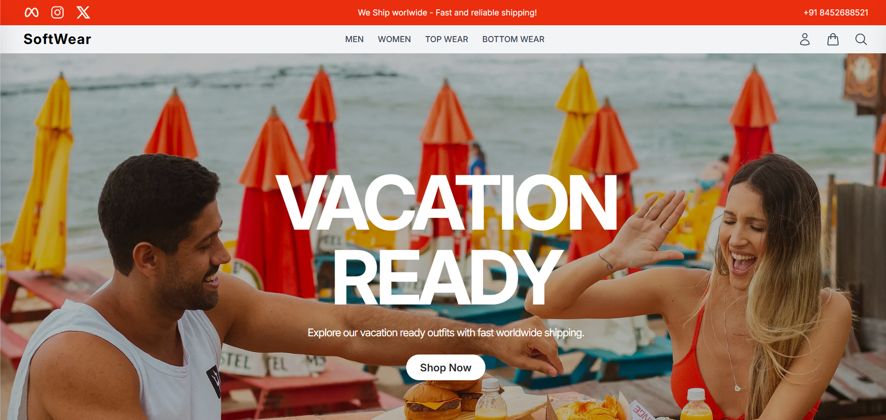
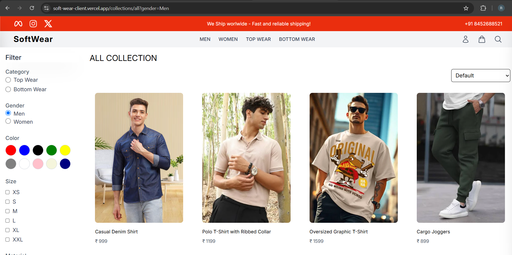
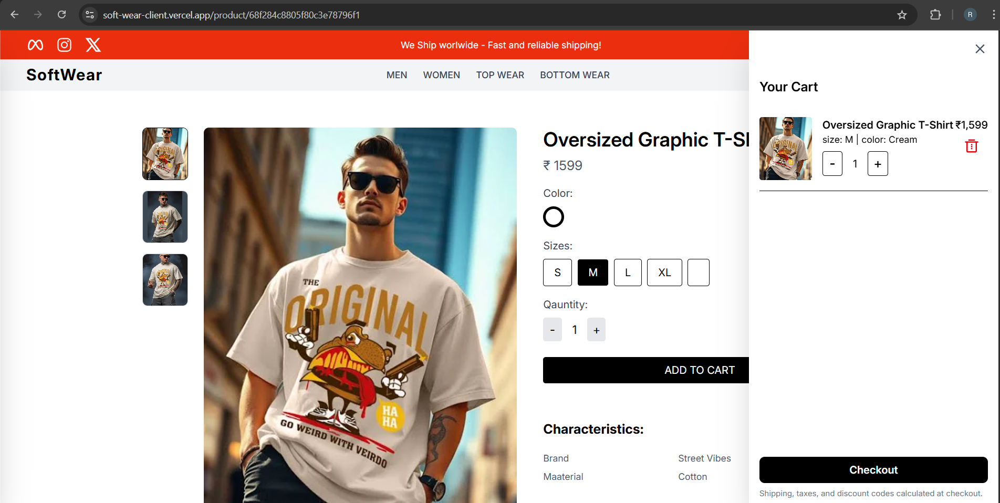
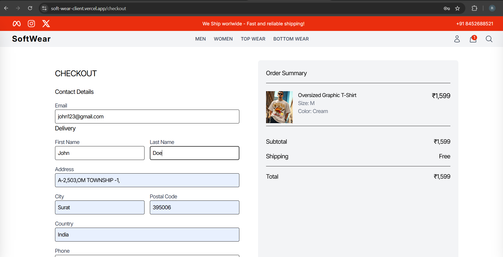
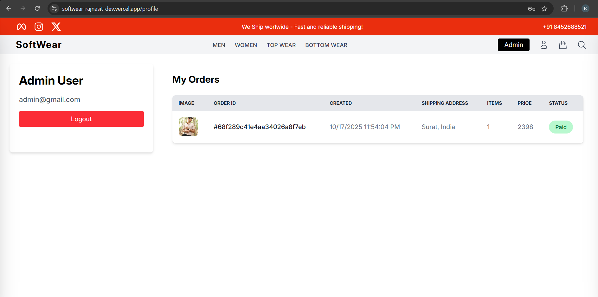
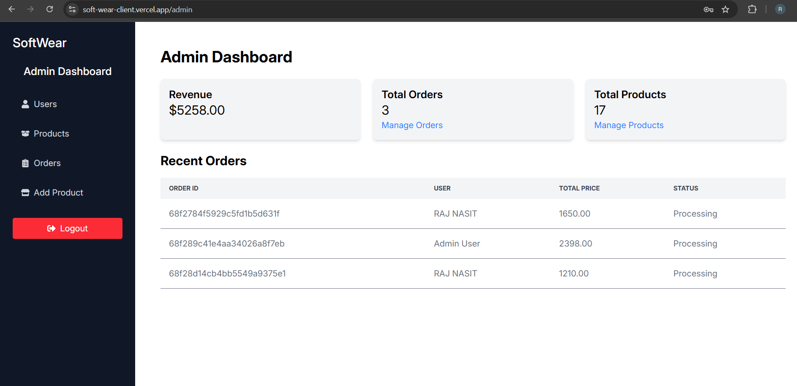

# SoftWear- An E-Commerce Website (using MERN Stack)

🚀 **Live Website:** 👉 [https://softwear-rajnasit-dev.vercel.app](https://softwear-rajnasit-dev.vercel.app)

## 📸 Screenshots

### 🎨 Project UI Preview

| 🏠 Home Page | 👕 Product Page | 🛒 Cart Page |
|:-------------:|:---------------:|:-------------:|
|  <br> *Homepage showing featured products* |  <br> *Individual product details and add-to-cart option* |  <br> *Cart summary with selected items and total price* |

| 💳 Checkout Page | 👤 Profile Page | 🧑‍💼 Admin Dashboard |
|:----------------:|:----------------:|:--------------------:|
|  <br> *Checkout page with payment options* |  <br> *User profile showing personal info and orders* |  <br> *Admin panel to manage products and orders* |


## 📌 Project Description
This is a full-stack e-commerce website built using the **MERN** stack – MongoDB, Express.js, React.js, and Node.js. Users can browse products, add them to the cart, and complete orders using a payment integration. The project follows best practices and covers both backend and frontend development.

## ✅ Features
- User authentication and authorization with JWT
- Product catalog with search and filters
- Add/remove items from the cart
- Place orders and make payments using Razorpay
- Responsive UI for mobile and desktop
- Admin panel for managing products and orders
- Secure routes and data validation

## 📂 Technologies Used
- **Frontend:** React.js, Redux, React Router
- **Backend:** Node.js, Express.js
- **Database:** MongoDB
- **Authentication:** JWT (JSON Web Tokens)
- **Payment:** Razorpay
- **Deployment:** Vercel

## ⚙️ Installation Instructions

### 1. Clone the Repository
```bash
git clone https://github.com/yourusername/SoftWear.git
cd SoftWear
